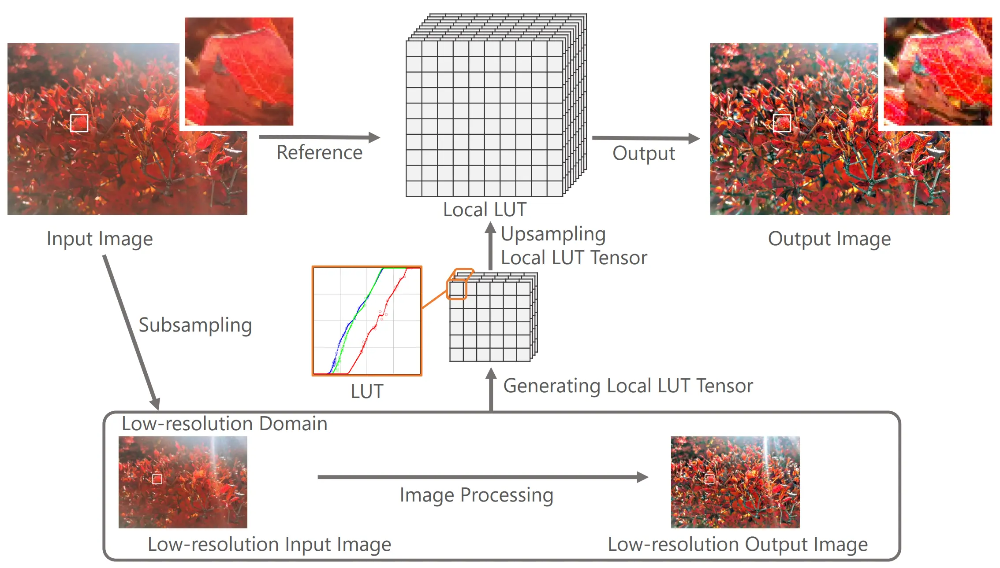

# Local Look-Up Table Upsampling for Accelerating Image Processing



# Paper
Teppei Tsubokawa, Hiroshi Tajima, Yoshihiro Maeda, and Norishige Fukushima
"Local Look-Up Table Upsampling for Accelerating Image Processing", Multimedia Tools and Applications, 2023.
```
@article{tsubokawa2023local,
    author  = {Tsubokawa, Teppei and Tajima, Hiroshi and Yoshihiro Maeda and Norishige Fukushima},
    title   = {Local look-up table upsampling for accelerating image processing},
    journal = {Multimedia Tools and Applications},
    year    = {2023},
    doi     = {doi.org/10.1007/s11042-023-16405-7},
    organization = {Springer}
}
```

# Link
* [[Web/Codes/Assessment Results/Dataset]](https://fukushimalab.github.io/LLF/)
* [[paper in Springer]](https://link.springer.com/article/10.1007/s11042-023-16405-7)
