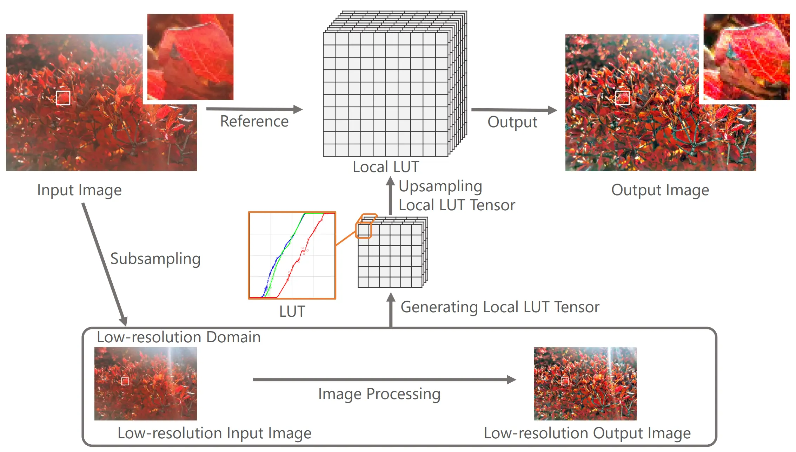
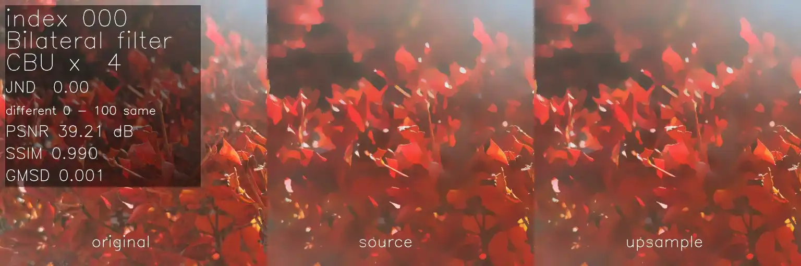

# Local Look-Up Table Upsampling for Accelerating Image Processing

This page provides the code, binary, subjective assessment results, and distortion dataset of local LUT upsampling of the following paper.

# Paper
Teppei Tsubokawa, Hiroshi Tajima, Yoshihiro Maeda, and Norishige Fukushima
"Local Look-Up Table Upsampling for Accelerating Image Processing," Multimedia Tools and Applications, 2023.

[[Springer site]](https://link.springer.com/article/10.1007/s11042-023-16405-7), This paper is open access.

## bibtex
```
@article{tsubokawa2023local,
    author  = {Tsubokawa, Teppei and Tajima, Hiroshi and Yoshihiro Maeda and Norishige Fukushima},
    title   = {Local look-up table upsampling for accelerating image processing},
    journal = {Multimedia Tools and Applications},
    year    = {2023},
    doi     = {doi.org/10.1007/s11042-023-16405-7},
    organization = {Springer}
}
```



## Abstract
The resolution of cameras is increasing, and speedup of various image processing is required to accompany this increase. A simple way of acceleration is processing the image at low resolution and then upsampling the result. Moreover, when we can use an additional high-resolution image as guidance formation for upsampling, we can upsample the image processing results more accurately. We propose an approach to accelerate various image processing by downsampling and joint upsampling. This paper utilizes per-pixel look-up tables (LUTs), named local LUT, which are given a low-resolution input image and output pair. Subsequently, we upsample the local LUT. We can then generate a high-resolution image only by referring to its local LUT. In our experimental results, we evaluated the proposed method on several image processing filters and applications: iterative bilateral filtering, ℓ0
 smoothing, local Laplacian filtering, inpainting, and haze removing. The proposed method accelerates image processing with sufficient approximation accuracy, and the proposed outperforms the conventional approaches in the trade-off between accuracy and efficiency. Our code is available at https://fukushimalab.github.io/LLF/.
 
# Code
The code of local LUT upsampling is integrated into OpenCP, which uses [OpenCV](https://opencv.org/).

* The OpenCP repository contains the optimized code (AVX vectorization and OpenMP parallelization) used in our experiments.
    * [OpenCP](https://github.com/norishigefukushima/OpenCP)
    * [localLUTUpsample header](https://github.com/norishigefukushima/OpenCP/blob/master/include/localLUTUpsample.hpp)

## Usage
The simple code for using the class of local LUT upsampling is as follows.

```cpp
void testSimple()
{
        cp::LocalLUTUpsample llu;
        //images
        cv::Mat srchigh, dstlow, srclow, dsthigh;
        srchigh = cv::imread("source.png");//high resolution source image
        dstlow = cv::imread("processed.png");//low resolution processed image
        //parameters
        int r = 2;//kernel radius for building LUT from correspondence of low resolution source and processed image
        int lut_num = 256;// the size of LUT per pixel 
        int R = 2;// filtering radius for a LUT (LUT smoothing)
        cp::LocalLUTUpsample::BUILD_LUT buildLUT = cp::LocalLUTUpsample::BUILD_LUT::L2_MIN;//building LUT method
        cp::LocalLUTUpsample::UPTENSOR upsampleLUT = cp::LocalLUTUpsample::UPTENSOR::GAUSS64;//tensor upsampling method
        cp::LocalLUTUpsample::BOUNDARY boundaryLUT = cp::LocalLUTUpsample::BOUNDARY::LINEAR;//boundary condition of LUT
        bool useOffset = true;//with/without offset map
        //run
        cv::resize(srchigh, srclow, dstlow.size());//down sample high resolution source image
        llu.upsample(srclow, dstlow, srchigh, dsthigh, r, lut_num, R, buildLUT, upsampleLUT, boundaryLUT, useOffset);//body
        //show
        cv::imshow("out", dsthigh);
        cv::waitKey();
}
```

# Binary
The pre-compiled binary can be downloaded.
The zip file contains OpenCV and OpenCP DLLs.
* [download LLU binary (under construction)](LLU.zip)

The binary is built by VisualStudio2022 with OpenCV4.8 and OpenCP on Windows.
If the redistribution package for VisualStudio2022 is installed on your PC, please install vc_redist.x64.exe file from the direct link.

* [VisualStudio2022 redistribution package for x64](https://aka.ms/vs/17/release/vc_redist.x64.exe)

## Requirement
* AVX2-supported computer, e.g., Intel (4th generation Core-i or later) or AMD (Zen or later).
    * Intel's low TDP CPU, such as ATOM, only supports Alderlake-N or later.

## Usage
### Simplest option
```
LLU source.png processed.png out.png
```
* source.png: input high resolution image 
* processed.png: input low resolution processed image
* out.png: upsampling result


### Longest option
```
LLU source.png processed.png out.png -r=2 -n=256 -R=2 -L=0 -U=6 -B=3 -o -d
```
* -r=2: kernel radius of building LUT is 2
* -n=256: size of LUT per pixel is 256
* -R=2: filtering radius for range domain of LUT is 2 (LUT value smoothing)
* -L=0: building LUT method is L2 distance minimization
* -U=6: LUT tensor upsampling method is Gauss64 (8x8 kernel).
* -B=3: boundary condition of LUT is linear method
* -o: using offset map, no meaning in 256 LUT case. 
* -d: using GUI debug for local LUT (call `guiLUT` method).

### Help
The following options show help message: `-h`, `-?`, `--help `.
```
>LLU -h

local LUT upsampling
Usage: LLU [params] src_img proclow_img dest

        -?, -h, --help (value:true)
                show help command
        -B, --boundary_lut (value:3)
                method of boundary of LUT (0: replicate, 1: minmax, 2: 0-255, 3: linear, 4: no interpolation)
        -L, --build_lut (value:0)
                method of building LUT (0:L2, 1:L1, 2: Linf, 3: WTA, 4: DP)
        -R, --lut_radius (value:2)
                radius of LUT filtering in range domain
        -U, --upsample_lut (value:6)
                method of upsampling LUT (0:NN, 1:Box4, 2: Box16, 3: Box64, 4: Gauss4, 5: Gauss16, 6: Gauss64, 7: Linear, 8: Cubic)
        -d, --debug
                GUI of viewing local LUT ('q' is quit key for GUI)
        -n, --numlut (value:256)
                size of LUT in range domain
        -o, --offset
                use offset map
        -r, --radius (value:2)
                radius of upsampling

        src_img
                source low image
        proclow_img
                processed low image
        dest (value:out.png)
                dest image
Example:
LLU source.png processed.png out.png -r=2 -n=256 -R=2 -L=0 -U=6 -B=3 -o -d
```

# Subjective Assessment Results / Distortion Image Dataset
Subjective assessment results for each upsampling method can be downloaded.
We upload distorted images and their scores for the assessment.

* [download link (544.1 MB)](https://drive.google.com/file/d/1p0BxJkWahT5jvVl9BWvjdvoWAMW10kse/view?usp=sharing)

The file is uploaded to Google Drive and is not included in the GitHub repository.
If you run the code for the subjective assessment, please unzip the file to img directory.

The following code is an example of how to read images and JND files in C++.
* [code](https://github.com/fukushimalab/LLF/blob/main/LLU/testReadSubjective.cpp)

The zip file contains 429 images and JND.csv
Directly
```
MTA_subjective_assessment
 +processed_source   ( 20 images): processed images (5 images x 4 processing types)
 +processed_upsample (400 images): upsampled processed images (5 images x 4 processing types x 5 upsampling types x 4 levels)
 +original:          (  9 images): original images
 +JND.csv                        : JND results
```
## Images
* 5 images
  * per processing type
* 4 Processing type
  * bf (bilateral filtering), l0 (L0 smoothing), ll (local Laplacian filtering), hz (haze removing) by upsampling 
* 5 upsampling types
  * cubic, JBU, GIU, BGU, LLU
* 4 upsampling levels
  * x4, x16, x64, x256

## CSV
The assessment result of "jnd.csv" contains the following information.

* index
    * indices for each score (0-419)
* distortion
    * 0: bf, 1:l0, 2: ll, 3: hz
* image
    * image index 0-4
* upsample
    * 0: CU, 1: JBU, 2: GIU, 3: BGU, 4: LLU (Proposed)
* level (downsampling ratio)
    * -1: no downsampling, 0: 1/4, 1: 1/16, 2: 1/64, 3: 1/256
* ID1-11, ave
    * JND results: 0: not same, 1: same

## Example of Dataset


# Link
 This paper uses two external datasets, and the following shows the download links.
* [HRHP: high-resolution high-precision images dataset](http://imagecompression.info/test_images/)
* [T-Recipes: Transform Recipes dataset](https://groups.csail.mit.edu/graphics/xform_recipes/dataset.html) [^1]

 [^1] M. Gharbi , Y. Shih, G. Chaurasia, J. Ragan-Kelley, S. Paris, F. Durand, "Transform recipes for efficient cloud photo enhancement," ACM Trans Graph 34(6), 2015.